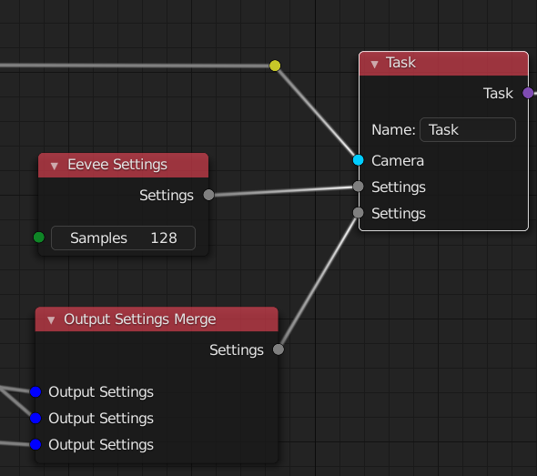
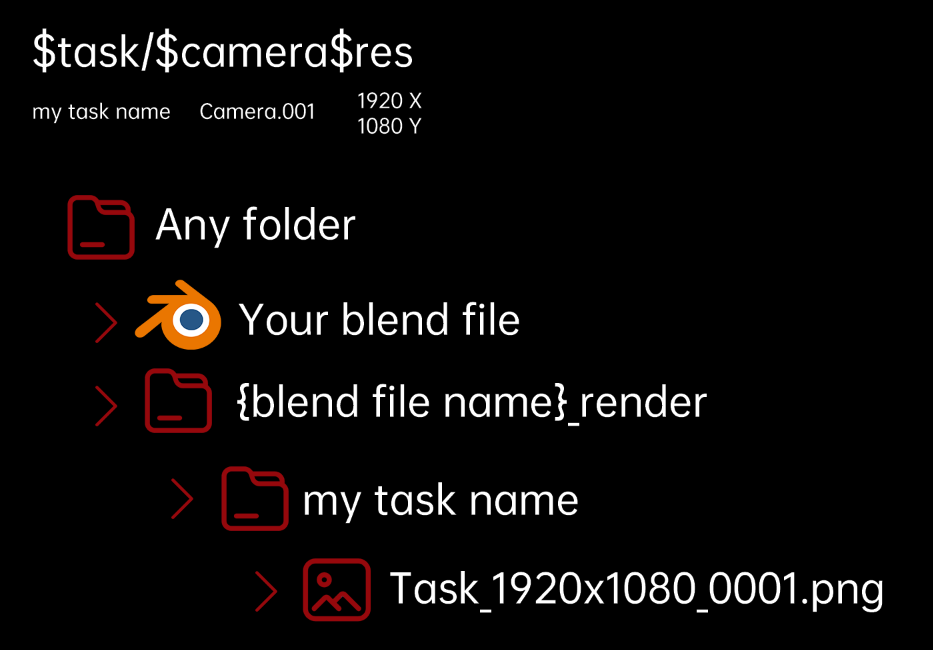

# Node-based RenderStack [Blender Addon]

### **Design Target**

Provide users with node-based, flexible rendering output methods

### Features

> version 0.5 alpha
>
> 中文介绍请看视频 https://www.bilibili.com/video/BV1wr4y1c7Tt/

+ Camera overide
+ Render Engine overide （Workbench,Eevee,Cycles）
+ Output Setting overide  (Frame Range,Resulotion,path（format file name support）,image settings)
+ View overide settings

### How it works

 + **Render List Node** is a render task list for what you need to render.It also  provide the 'Render' button and the 'View' button.You can render your task through this node. *Now you are only able to render one renderlist at once*

 + **Task Node** You need a task node to countains all the settings you need to change(compare to the current settings)
 + **Camera Node** have the ability to change the camera
 + **file path Node** give an format name of the render files
 + **Eevee Setting Node** means that in this task you will render with the eevee engine
 + **Frame Range Node** control the frame you want to render

> *Once you plug a node settings to overide something into the a task,the next task will inherit it if there is not a same type Node plug input. So you may start a new render list to keep your node tree cleaner*

### Nodes

+ Render List 

	> Provide Viewer operator for input tasks, and render all the input task

+ Task

    > output task( Link to the render list node)
    >
    > all the overide settings is link to this node 

+ Camera 

	> Camera overide input

+ File path

    > format ouput of the file name 
    >
    > 

+ Eevee Settings / Cycles Settings / Work Bench Settings

    >  change the render engine