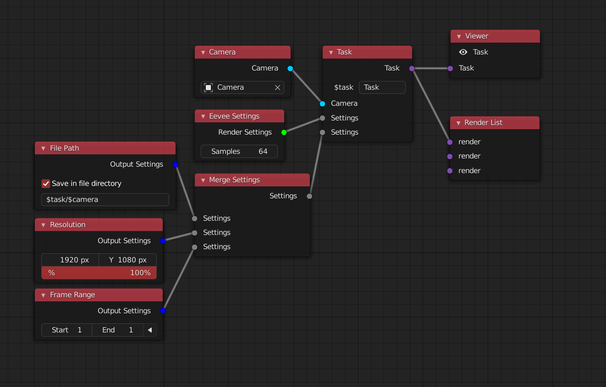
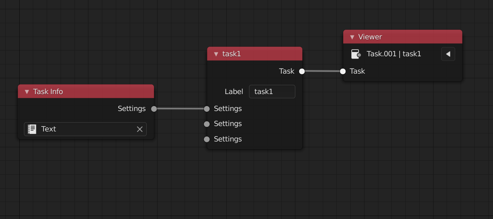

# RenderStackNode [Blender Addon]

>  **Design Target**
> Provide users with node-based, flexible rendering output workflow


### Features v 1.1.0

+ Camera overwrite
+ Render engine overwrite 
    + Workbench,Eevee,Cycles
    + Luxcore
+ Output setting overwrite 
    + Frame Range
    + Resulotion,
    + path (format file name support)
    + image settings
+ Object  overwrite 
    + Material
    + Location/Rotation/Scale
    + Display
+ Script overwrite
+ Viewer Node 
+ Renderlist  (render all task)
+ Smtp email 
+ Render Process
    + render info confirm
    + process bar
+ View layer passes output

> Known Error:
> Render with cuda may cause blender internal errors (python state error)


### How it works


1. Use **Settings Node** to overwirte your render settings,such as:

	+ **Camera Node** have the ability to change the camera
	+ **File path Node** give an format name of the render files
	+ **Eevee Setting Node** means that in this task you will render with the eevee engine
	+ **Frame Range Node** control the frame you want to render

2. Use **Task Node** to merge your changes into one render task (animation or still image)

3. Use **Viewer Node** to check your overwriten scene

4. Use **Render List Node** to render all the task that you need

> *Once you plug a node settings to overide something into the a task,the next task will inherit it if there is not a same type Node plug input. So you may start a new render list to keep your node tree cleaner*


**But also, we can use node like this**


> In 1.1.0 version, there is a **task info** node for direct input the changes with text file:
> when it links to a **task** which is linking to a **viewer**,the scene will load these changes below

```json
{
    "label": "task1",
    "camera": "Camera",
    "engine": "BLENDER_EEVEE",
    "samples": 64,
    "use_blend_file_path": true,
    "path_format": "$blend_render/$label$camera",
    "path": "",
    "res_x": 1920,
    "res_y": 1080,
    "res_scale": 100
}
```


### Install

##### Familiar with **git**

If you are familiar with **git**, just go to your addon folder(For example,you are using windows)

`C:\Users\{YourUserName}\AppData\Roaming\Blender Foundation\Blender\2.92\scripts\addons`

Then right click and **git bash here**, type in:

`$ git clone https://github.com/atticus-lv/RenderStackNode.git`

**For Other User**

Click 👇Code to down the zip file, then install as usual addon 


### Plans

+ muti blend file ( socket modules or command line )
+ octane/redshift support ( actually you can make it with script node)
+ mesh export
+ sim task


