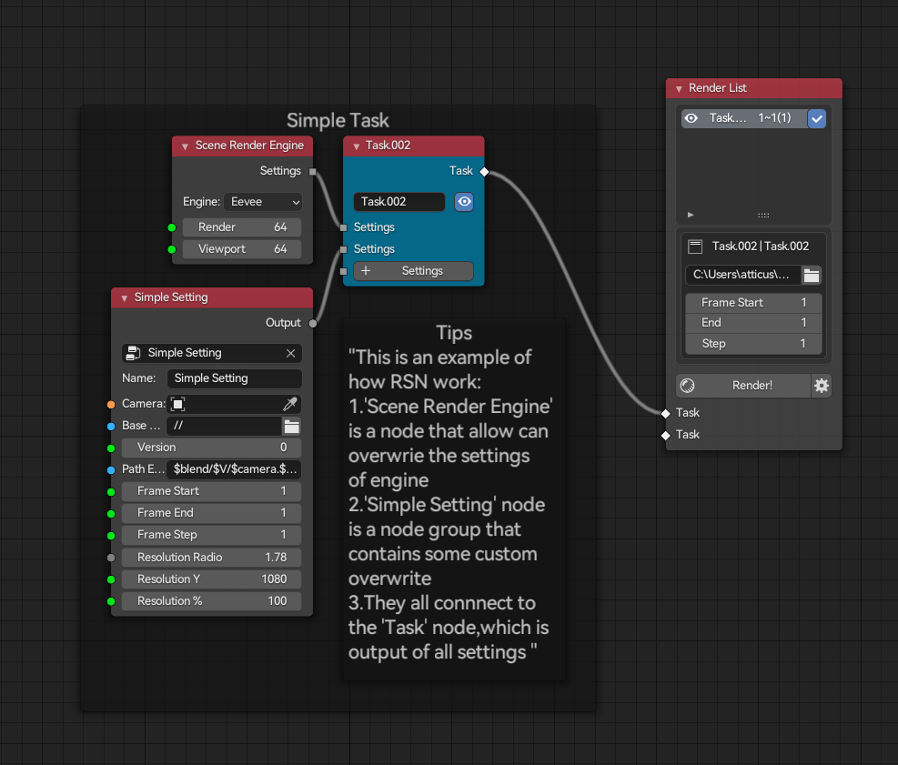

  

<h4 align="center">
    Node based design and render workflow in blender 
</h4>

    Documentation ➡️
    <a href="https://atticus-lv.github.io/RenderStackNode/#/">
	[Github] 
    </a>
    <a href="https://atticus-lv.gitee.io/renderstacknode">
    <tr>[Gitee]
    </a>

### Feature

| v1.2.4           | Description                                            |
| ---------------- | ------------------------------------------------------ |
| Render queue     | render animation and still frame in one queue          |
| UI               | processor bar,viewport gpu draw nodes,tab search       |
| Custom Overwrite | all properties can be overwrite and update in viewport |
| Path Expression  | use $ to generate formatted name                       |
| Version Control  | various sth and set various in one task                |
| Path Expression  | use $ to generate formatted name                       |
| Third Party      | Octane, Luxcore, SSM(an other addon of mine)           |

**Preview**

### Download ](https://img.shields.io/badge/blender-2.93%2B-red)

**Stable** *Ready for work*

[Stable 1.2.4.1 📚 ](https://github.com/atticus-lv/RenderStackNode/releases/tag/v1.2.4)

### Develop Feature 

**Develop** *New features, change any time before stable*:

[https://github.com/atticus-lv/RenderStackNode/archive/develop.zip](https://github.com/atticus-lv/RenderStackNode/archive/develop.zip)

+ Nodes
  
    + group nodes

    + new variant node(no'Set Variants Node'any more, use a direct input socket)

    + input nodes (object/material/float/vector/int/bool/string)

    + utility nodes (math/vector,boolean math/string operate)

+ Performance

    + use part of update system from rigging_nodes, provide faster speed

+ UI
    
    + remove old draw outline, draw process time and node name instead instead
    
    + auto create enums(scene render engine node, color manage node),update and remove sockets
    
    + remove render sheet, provide a cleaner list with auto update inputs tasks
    
+ Know Limited
  
    + When edit inside a render node group, it won't update the whole tree, you should always set the active task on the base root
    
    + old node are not fully support yet
    
### Support me

blendermarket: https://blendermarket.com/products/renderstacknode

alipay: 1029910278@qq.com
