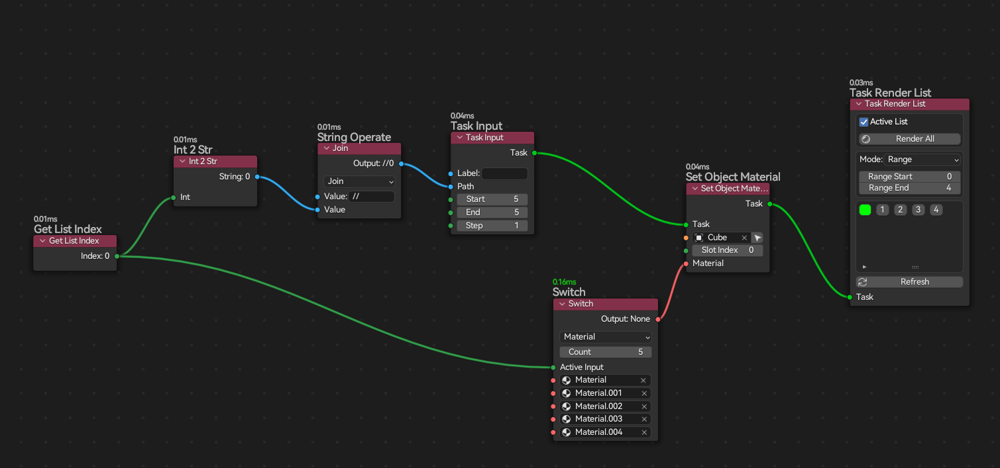
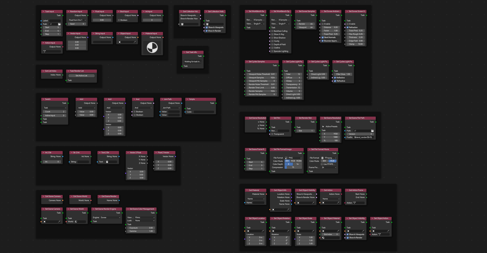

  

<h4 align="center">
    Node based design and render workflow in blender 
</h4>

    Documentation ➡️
    <a href="https://atticus-lv.github.io/RenderStackNode/#/">
	[Github] 
    </a>
    <a href="https://atticus-lv.gitee.io/renderstacknode">
    <tr>[Gitee]
    </a>

## Develop Feature 

**Down** *New features, change any time before stable*:

[https://github.com/atticus-lv/RenderNode/archive/refs/heads/develop.zip](https://github.com/atticus-lv/RenderNode/archive/refs/heads/develop.zip)

#### Geometry Nodes field style workflow 

+ Much easier, faster and cleaner

#### Nodes

+ group nodes
+ new switch node for all types sockets (no 'Variants Node'any more, use a direct input socket)
+ input nodes (object/material/float/vector/int/bool/string)
+ utility nodes (math/vector,boolean math/string operate)
+ get / set nodes
+ new render list node and get render list index node

+ Performance (Evaluate system)

    + develop based on rigging_nodes , provide faster speed

+ UI

    + remove old draw outline, draw process time and node name instead instead

    + dynamic enums/sockets for user' preference (render engine, color manage,etc)

    + power selector for switch active task in render list node

      

#### Know Limited

  + When edit inside a render node group, it won't update the whole tree, you should always set the active task on the base root
  + old node remove

### Support me

blendermarket: https://blendermarket.com/products/renderstacknode

alipay: 1029910278@qq.com
