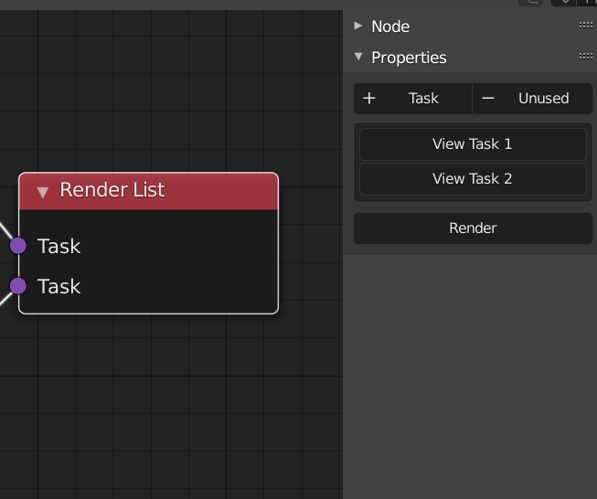
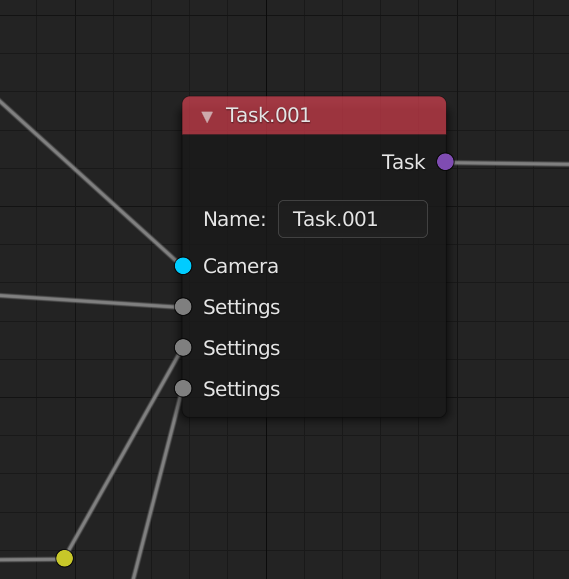
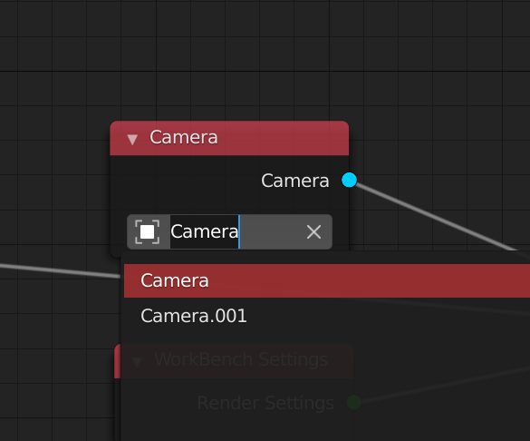
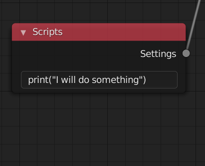
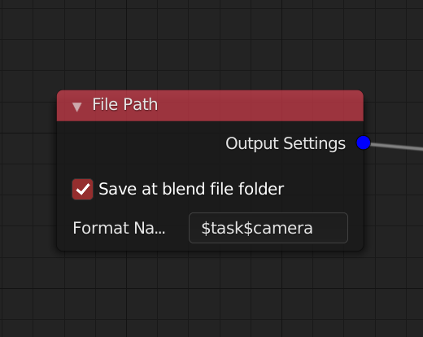
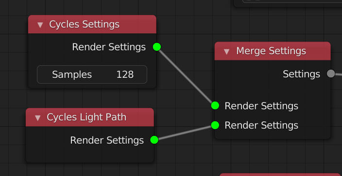

# RenderStackNode [Blender Addon]

> #### Still In Alpha! Nodes Change Before 1.0 !

### **Design Target**

Provide users with node-based, flexible rendering output workflow


### Features v0.8

+ Camera overide
+ Render Engine overwrite (Workbench,Eevee,Cycles)
+ Output Setting overwrite (Frame Range,Resulotion,path（format file name support）,image settings)
+ Allow script for overwrite 
+ Viewer Node (Just like Node Wrangler)
+ Render all task (list)
+ smtp email 

> Chinese intro video (v 0.5) 中文介绍请看视频 https://www.bilibili.com/video/BV1wr4y1c7Tt/


### How it works

 + **Render List Node** is a render task list for what you need to render.It also  provide the 'Render' button and the 'View' button.You can render your task through this node. *Now you are only able to render one renderlist at once*

 + **Task Node** You need a task node to countains all the settings you need to change(compare to the current settings)
 + **Camera Node** have the ability to change the camera
 + **file path Node** give an format name of the render files
 + **Eevee Setting Node** means that in this task you will render with the eevee engine
 + **Frame Range Node** control the frame you want to render

> *Once you plug a node settings to overide something into the a task,the next task will inherit it if there is not a same type Node plug input. So you may start a new render list to keep your node tree cleaner*


### Install

##### Familiar with **git**

If you are familiar with **git**, just go to your addon folder(For example,you are using windows)

`C:\Users\{YourUserName}\AppData\Roaming\Blender Foundation\Blender\2.92\scripts\addons`

Then right click and **git bash here**, type in:

`$ git clone https://github.com/atticus-lv/RenderStackNode.git`

**For Other User**

Click [here](https://github.com/atticus-lv/RenderStackNode/releases/tag/alpha) to down the latest stable release


### Important Nodes

#### Task Node

+ ##### Render List 

	> Render all the input task,also allow to view all the input task info
	
	
	
	*info format (shift click to get details)*:
	
	> *node name*
	
	```json
	{
	    "Task.002": [
	        "Camera.002",
	        "File Path.001",
	        "WorkBench Settings"
	    ]
	}
	```
	> *nodes details for each task*
	
	```json
	{
	    "task_name": "Task",
	    "camera": "Camera",
	    "use_blend_file_path": true,
	    "path_format": "$task/$camera",
	    "path": "C:\\Users\\atticus\\Desktop\\blender\\",
	    "engine": "BLENDER_WORKBENCH"
	}
	```
	
	
	
+ ##### Task List

    > Provide Viewer operator for input tasks

    

+ ##### Task

    > output task( Link to the render list node)
    >
    > all the overide settings is link to this node 

    

#### Settings Node

+ ##### Camera 

	> Camera overide input
	
	
	
+ ##### Scripts

    > Excute the python code when rendering/view this task

    

+ ##### File path

    > format ouput of the file name 
    
    
    
+ ##### Eevee Settings / Cycles Settings / Work Bench Settings

    >  change the render engine (merge node is not necessary)
    
    
    
    

### Plans

v 0.5

+ [x]  Basic renderstack with nodes 
+ [x]  eevee, cycles basic support 
+ [x]  camera, resulotion, frame range, file format, format file name support

v 0.6

+ [x]  script node for custom render settings overwriting
+ [x]  layout merge nodes(more organize)

v 0.7
+ [x]  render list merge node (or someting else for render all list)
+ [x]  viewlayers 
+ [x]  stmp email node 

v 0.8
+ [x] SSM (one of my addons for blender), light studio node( 0.23 version / highter)
+ [x] Viewer Node
+ [x] Worlds

v.1.0
+ [ ]  luxcore support
+ [ ]  passes for different enginge (output)

Planing... 

+ [ ] muti blend file ( socket modules or command line)
+ [ ] octane support
+ [ ] mesh export
+ [ ] remain taskes ui 


