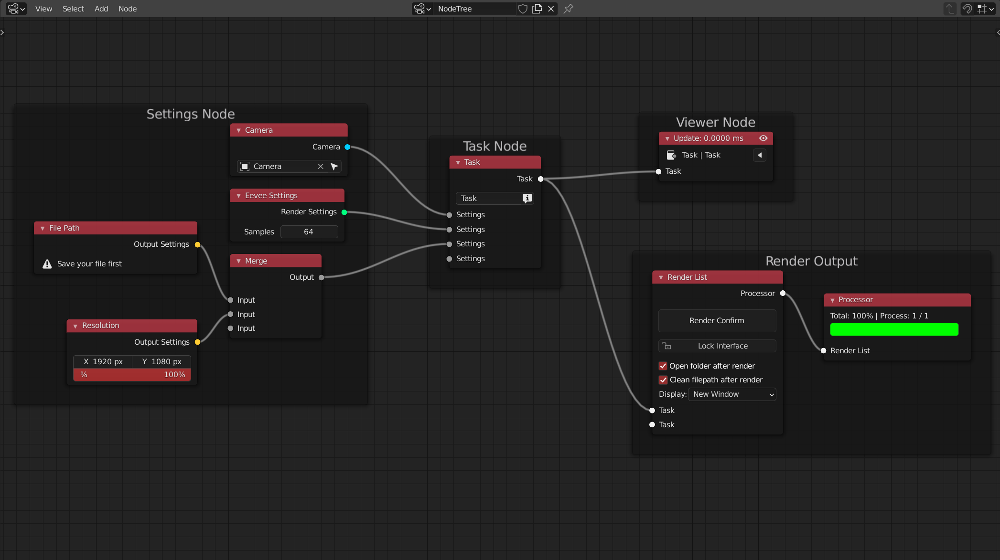

<!-- panels:start -->

<!-- div:left-panel -->

<!-- div:right-panel -->
> RSN takes the node settings, and use it to overwrite the scene

1. Settings Node to overwirte your render settings,such as:

    + **Camera Node** have the ability to change the camera
    + **File path Node** give an format name of the render files
    + **Eevee Setting Node** means that in this task you will render with the eevee engine
    + **Frame Range Node** control the frame you want to render

2. **Task Node** to merge your changes into one render task (so it can be use to render)

3. **Viewer Node**  apply and view the changes

4. **Render List Node**  render all the task that you need

*Once you plug a node settings to overide something into the a task,the next task will inherit it if there is not a same
type Node plug input. So you may start a new render list to keep your node tree cleaner*

<!-- panels:end -->

