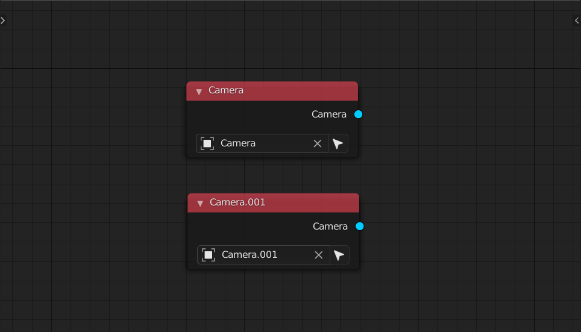
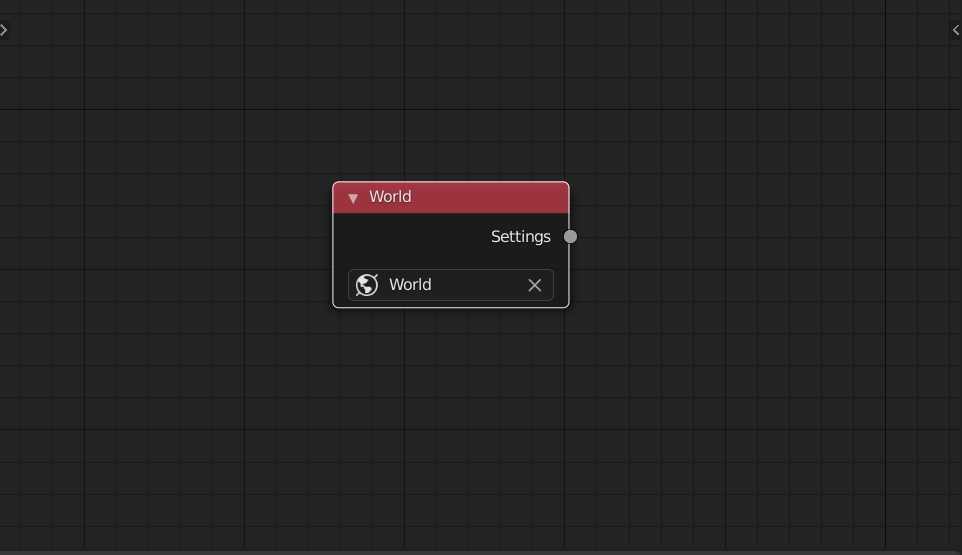
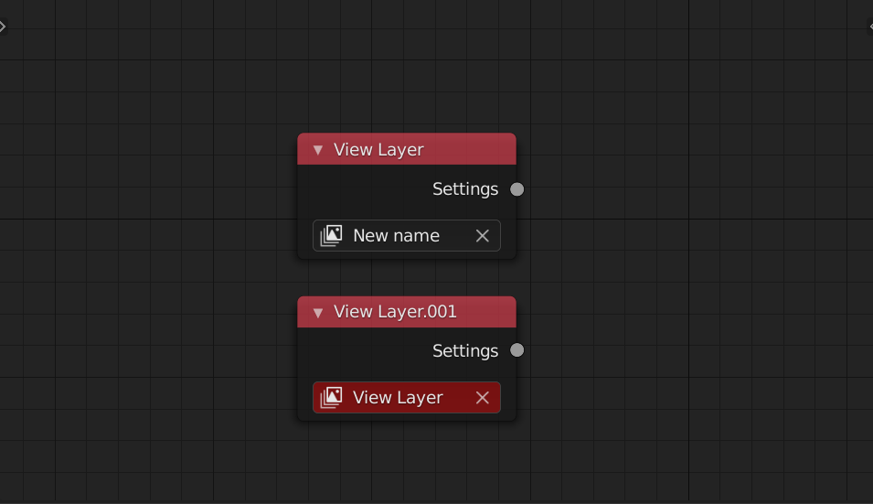
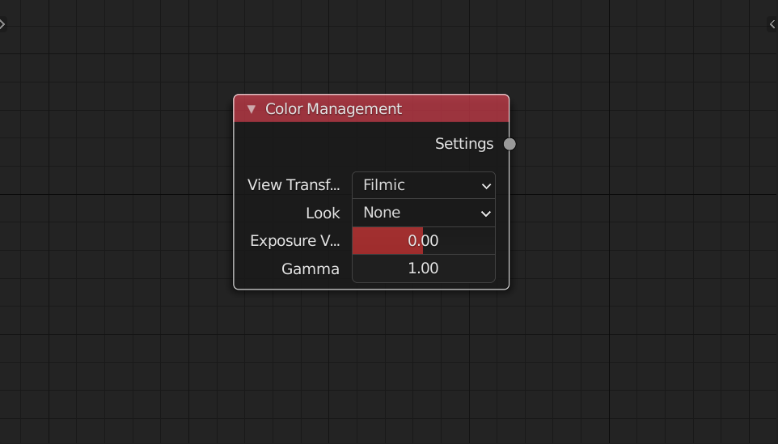
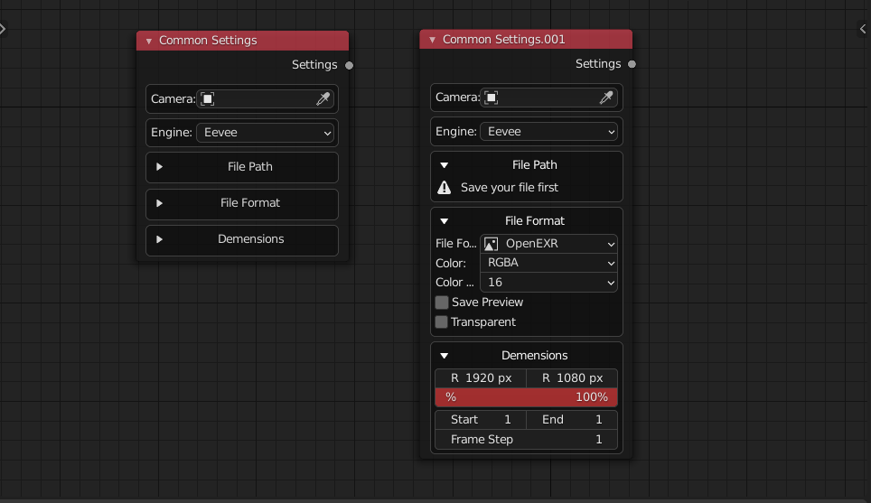
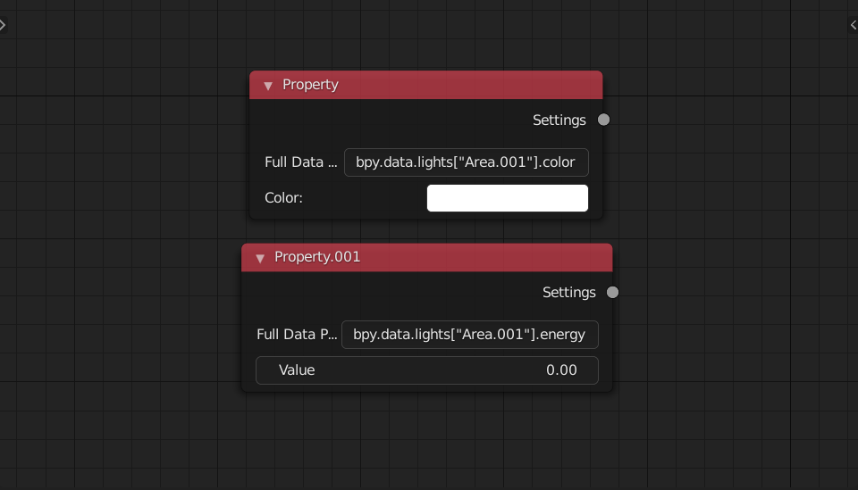
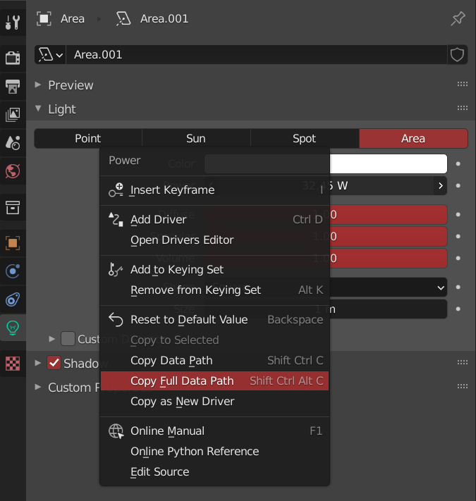
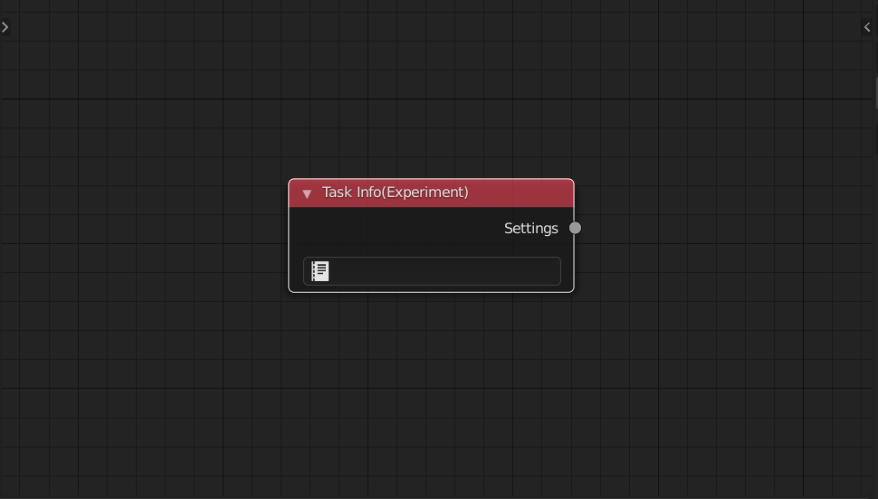

<!-- panels:start -->

<!-- div:title-panel -->

### Camera

<!-- div:left-panel -->

<!-- div:right-panel -->

> This node let you to set the camera object as the scene camera

<!-- panels:end -->

<!-- panels:start -->

<!-- div:title-panel -->

### World

<!-- div:left-panel -->

<!-- div:right-panel -->

> This node let you to set a world as the scene world

<!-- panels:end -->

<!-- panels:start -->

<!-- div:title-panel -->

### View Layer

<!-- div:left-panel -->

<!-- div:right-panel -->

> This node let you to set the context viewlayer of the scene. When you change the name of this viewlayer, make sure you update this node.
> 

<!-- panels:end -->

<!-- panels:start -->

<!-- div:title-panel -->

### Color Management

<!-- div:left-panel -->

<!-- div:right-panel -->

> This node let you to set the color management of the scene(default ocio only).

<!-- panels:end -->

<!-- panels:start -->

<!-- div:title-panel -->

### Common Settings

<!-- div:left-panel -->

<!-- div:right-panel -->

> This node contains several nodes camera, render engine, file path node, resolution, frame range
> 

<!-- panels:end -->

<!-- panels:start -->

<!-- div:title-panel -->

### Property

<!-- div:left-panel -->

<!-- div:right-panel -->

> This node allow you to asign value to any data in the scene. 
>
> Right click on the property you want to change, then selecet copy full path (blender 2.93) or press *ctrl shift alt C* Then paste it to the node and input the value through the control 

<!-- panels:end -->

<!-- panels:start -->

<!-- div:title-panel -->

### Task Info (Experimental)

<!-- div:left-panel -->

<!-- div:right-panel -->

> This node allow you to write changes in json way. Check out the **RenderList/Task** node for more details
> 

<!-- panels:end -->

