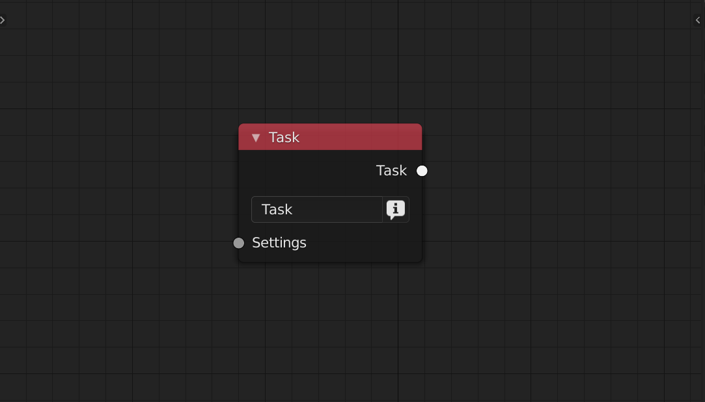
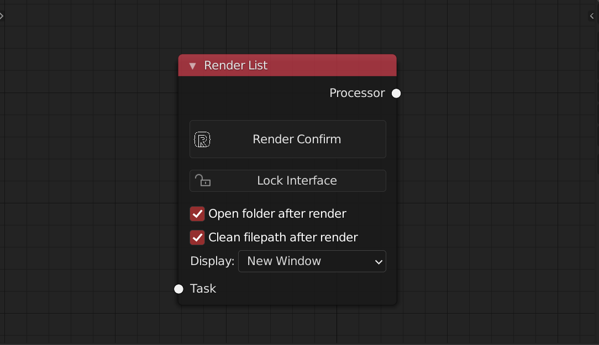
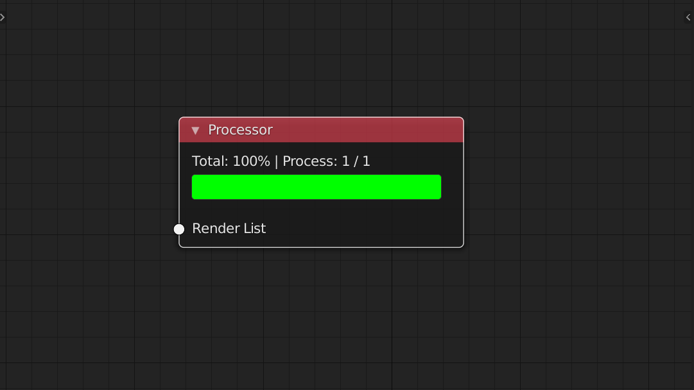
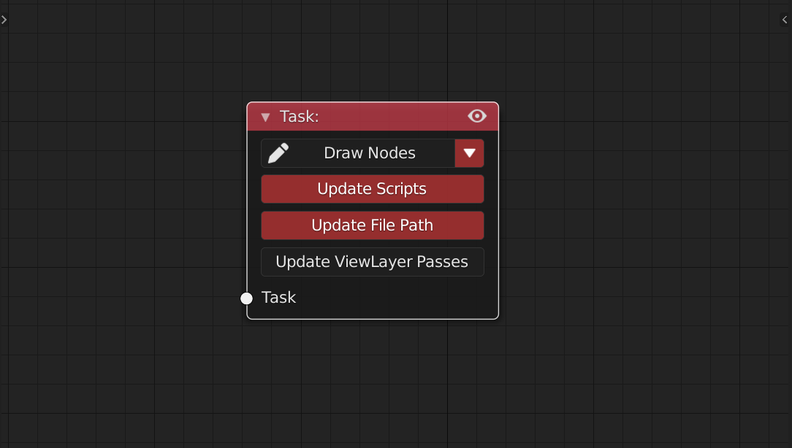

<!-- panels:start -->

<!-- div:title-panel -->

### Task

<!-- div:left-panel -->

<!-- div:right-panel -->

> Task node is the most important node of rsn. It contains changes for a task that can be use for render
>
> **Settings Input** can plug in any kind of settings node **Task output** can connect to RenderList node, viewer node and merge node

**Label** can be use in the file path node as output name

**Info Button** can view the information of the settings node

<!-- panels:end -->

<!-- panels:start -->

<!-- div:title-panel -->

### Render List

<!-- div:left-panel -->

<!-- div:right-panel -->

> Render list will get all the task that links to it. 
>
> **Task input** can connect to Task node or merge node

**Render confirm button**, you will get a render sheet. You can just press ok to start render. 

After click the Also , you can cancel some task by pressing the marker icon. It will mute the node so that the render list won't check it later. The info icon allow you to view the changes of this task. You can copy it can paste it in the text editor. Then use it with task info node

<!-- panels:end -->

<!-- panels:start -->

<!-- div:title-panel -->

### Processor

<!-- div:left-panel -->

<!-- div:right-panel -->

> Processor node provide you a process bar for each task. **RenderList input** can connect to RenderList node

If you break your render with "ESC",it will store the frame you stop You can set your own color for the done frames and the remain frames

<!-- panels:end -->

<!-- panels:start -->

<!-- div:title-panel -->

### Viewer

<!-- div:left-panel -->

<!-- div:right-panel -->

> When selecting a task node, you can press v to link a viewer node to view this task. 
>
> **Task input** can connect to Task node

**Update Scripts** will execute the python code in the scripts node when view the task

**Update FilePath** will overwrite the output path when view the task

**Update ViewLayer Passes** will generate the compose node tree when view the task

Options above will auto update when render 

If the task node is mute (by pressing M), it will check by the viewer node Make sure there is only one viewer node in your node tree.

<!-- panels:end -->

