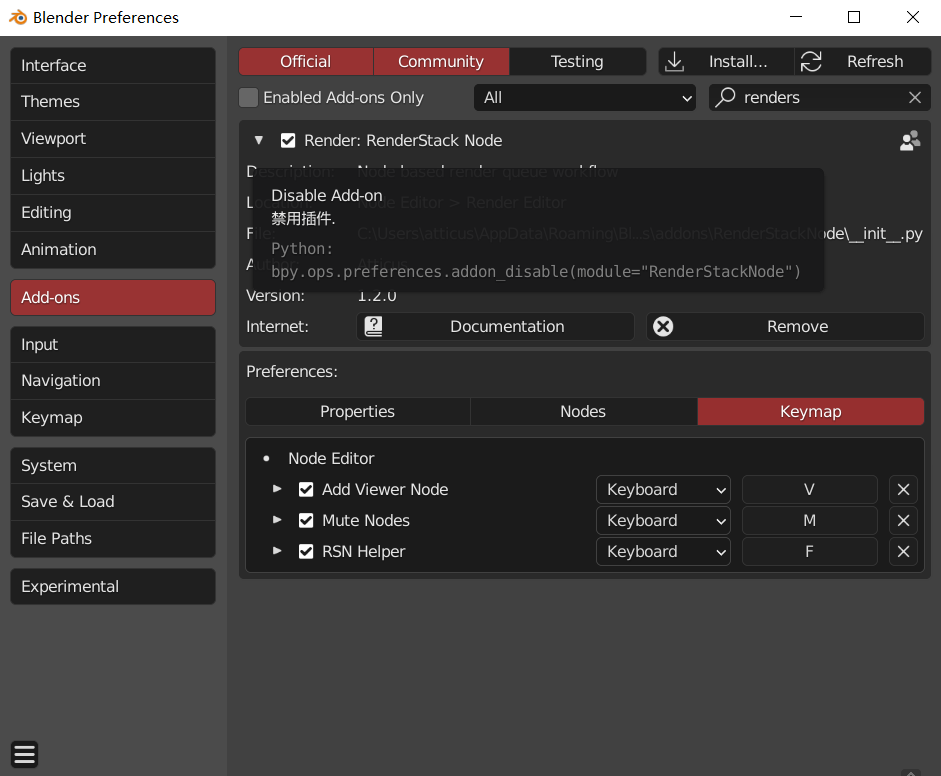
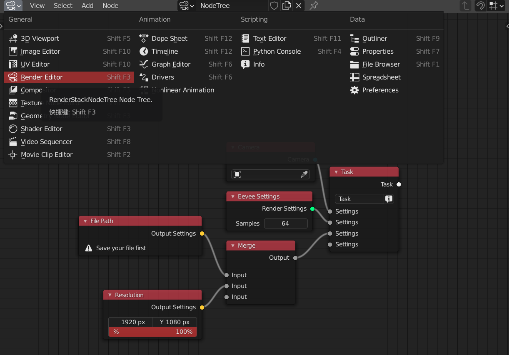
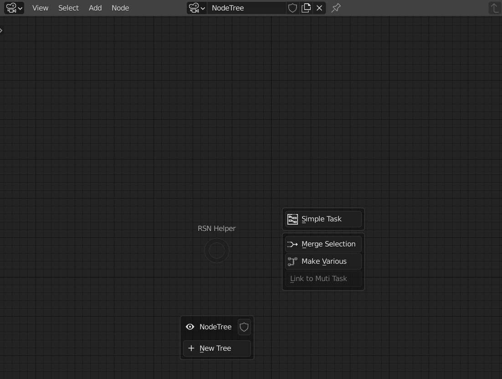
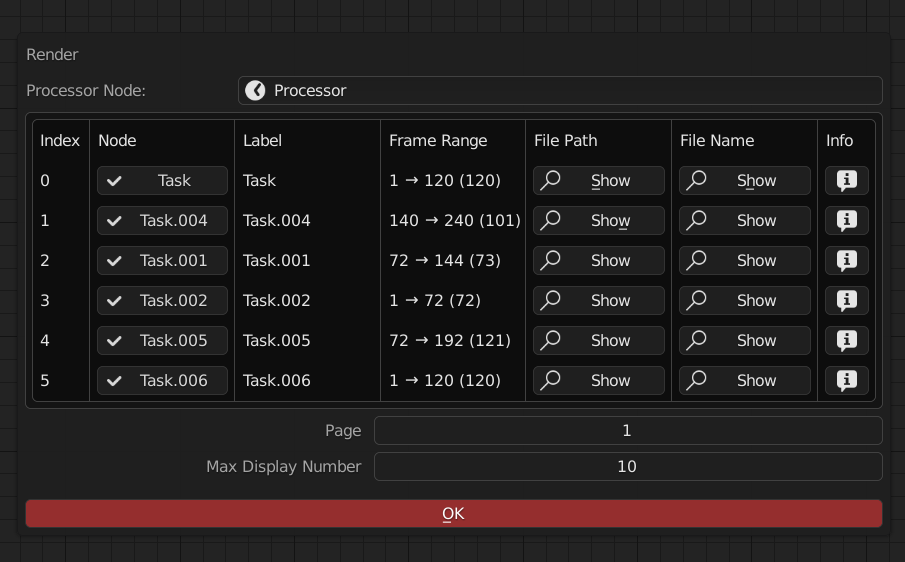

> 你可以在这些地方找到RSN

<!-- panels:start -->

<!-- div:title-panel -->

### 偏好设置

<!-- div:left-panel -->

<!-- div:right-panel -->

> 在这里，你可以设置RSN插件的偏好，这将会影响整体的使用方式

<!-- tabs:start -->

### **Property**

用于设置log等级

### **Nodes**

用于设置一些节点的默认行为

+ Viewer
    + 视口更新参数
+ FilePath
    + 设置filepath节点的默认路径表达式
+ SMTP
    + 可以在这里填写smtp服务器和密码，然后就可以使用smtp节点来发送邮件了

### **Keymaps**

用于更改快捷键

+ Add Viewer node : 选择一个task节点并按快捷键添加viewer节点
+ Mute node : 对所选的节点进行禁用
+ Helper menu : 节点编辑器中的饼菜单

<!-- tabs:end -->

<!-- panels:end -->

<!-- panels:start -->

<!-- div:title-panel -->

### 节点编辑器

<!-- div:left-panel -->

<!-- div:right-panel -->

> [!TIP]
> 你的大多数操作将会在这里进行

<!-- panels:end -->

<!-- panels:start -->

<!-- div:title-panel -->

### 饼菜单/侧面板

<!-- div:left-panel -->

<!-- div:right-panel -->

> [!TIP]
> 一个帮助菜单，用于提高工作效率

<!-- panels:end -->

<!-- panels:start -->

<!-- div:title-panel -->

### 渲染确认表

<!-- div:left-panel -->

<!-- div:right-panel -->

> [!TIP]
> 点击 *RenderList* 节点上的渲染按钮后出现，用于最终渲染的时候确认信息

<!-- panels:end -->

