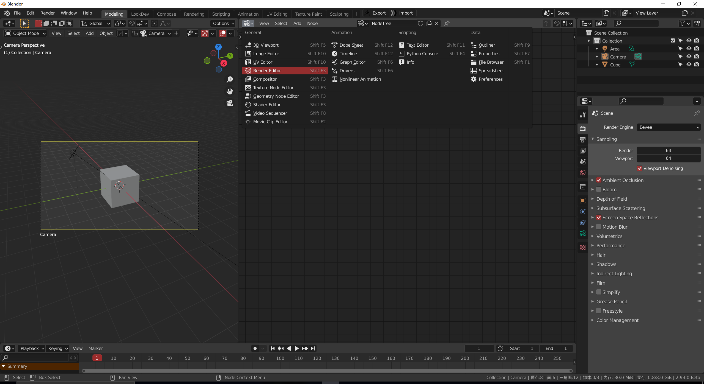
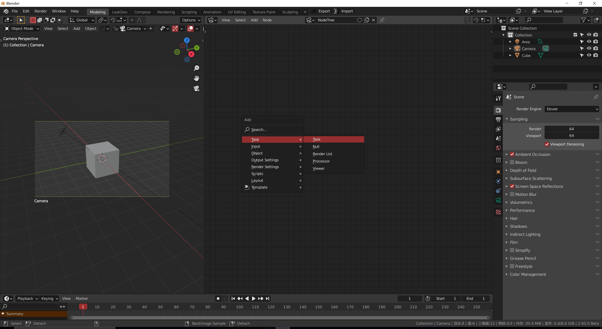
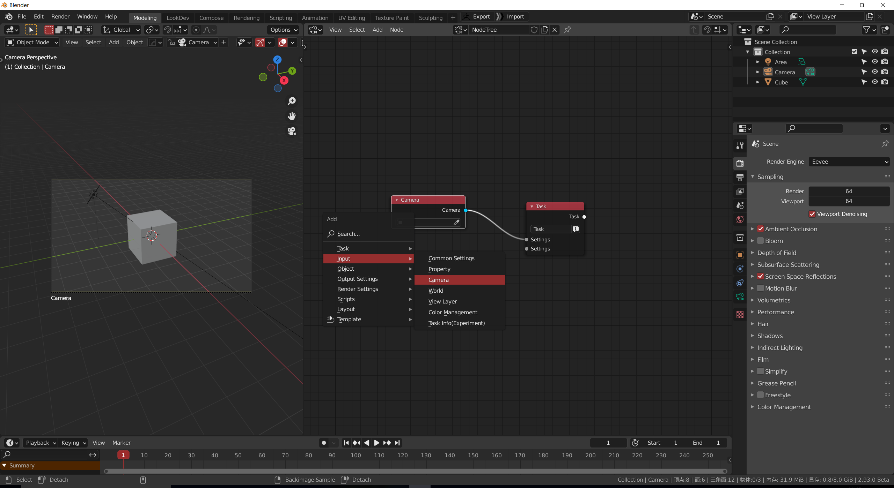
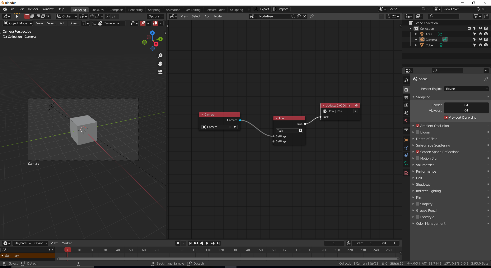
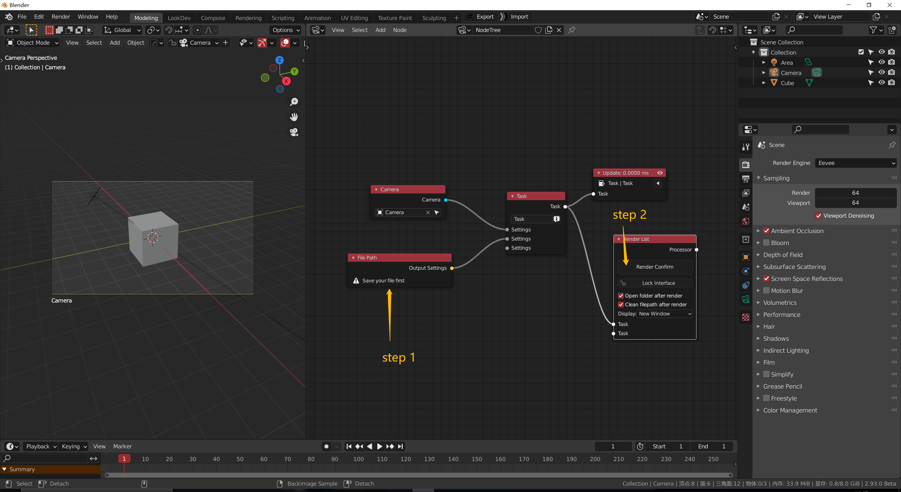
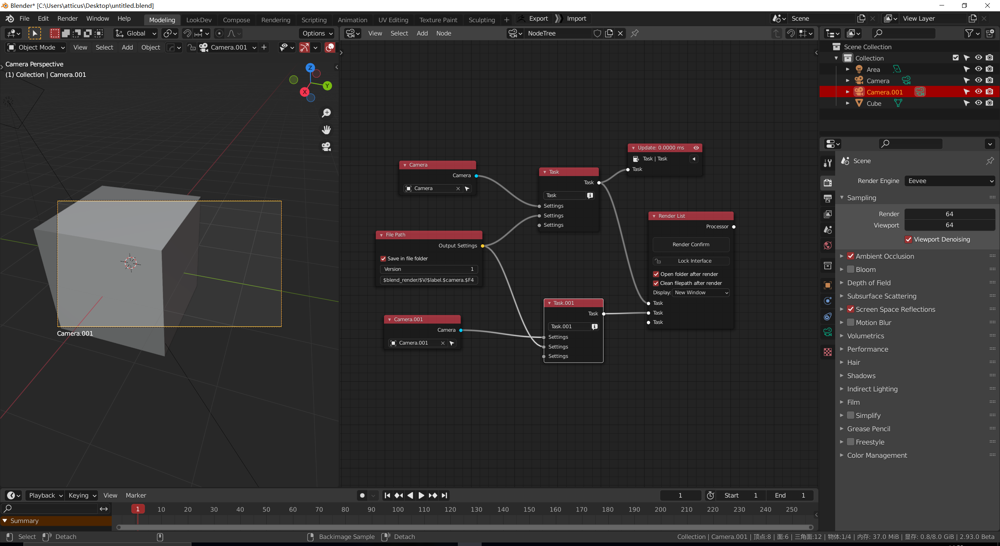

<!-- panels:start -->

<!-- div:title-panel -->

### 1. 设置节点界面

<!-- div:left-panel -->

<!-- div:right-panel -->

> [!NOTE]
> 你可以按快捷键F来新建节点树
>
> 记得要启用保护（伪用户）

<!-- panels:end -->

<!-- panels:start -->

<!-- div:title-panel -->

### 2. 设置一个task节点

<!-- div:left-panel -->

<!-- div:right-panel -->

> [!NOTE]
> task节点用于连接所有设置类的节点

<!-- panels:end -->

<!-- panels:start -->

<!-- div:title-panel -->

### 3. 连接一些你想要修改的设置类节点

<!-- div:left-panel -->

<!-- div:right-panel -->

> [!NOTE]
> 在图中，我生成了一个相机节点
>
> 这个节点能够帮助我们设置场景相机

<!-- panels:end -->

<!-- panels:start -->

<!-- div:title-panel -->

### 4. 使用 viewer 节点来应用设置到场景当中

<!-- div:left-panel -->

<!-- div:right-panel -->

> [!NOTE]
> 选择一个task节点，按快捷键v，就会生成一个连接到他的viewer节点
>
> 一个节点树只能有一个viewer节点

<!-- panels:end -->

<!-- panels:start -->

<!-- div:title-panel -->

### 5. 设置file path, renderlist节点并且渲染

<!-- div:left-panel -->

<!-- div:right-panel -->

> [!NOTE]
> **先保存你的文件！**
>
> 不然的话，就没有办法渲染
>
> filepath 节点将为图像提供一个格式化输出的文件名字

<!-- panels:end -->

<!-- panels:start -->

<!-- div:title-panel -->

### 6. 为另外一个镜头添加新的渲染任务

<!-- div:left-panel -->

<!-- div:right-panel -->

> [!NOTE]
> 如果你想要渲染两个相机，你就要设置两个task（任务）
>
> 他们都连接到一个相同的filepath节点，但是有着不同的相机节点

<!-- panels:end -->

